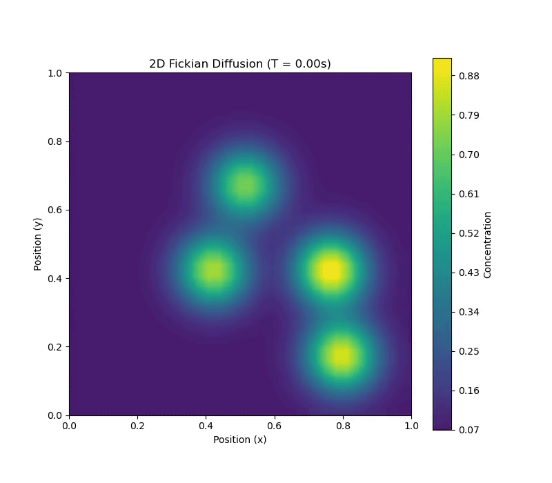

# Fickian Diffusion from Free Energy Minimization

Fick's laws of diffusion describe the net movement of particles from an area of higher concentration to an area of lower concentration. This macroscopic observation is fundamentally a consequence of the system's tendency to maximize its entropy, or equivalently, minimize its free energy. The driving force for this particle transport is the gradient of the chemical potential (μ).

The flux of particles, `J`, can be expressed as being proportional to the gradient of the chemical potential:

$$ J = -M c \nabla \mu $$

Where:
- `J` is the diffusion flux.
- `M` is the particle mobility.
- `c` is the concentration.
- `μ` is the chemical potential.

For an ideal solution, the chemical potential is given by:

$$ \mu = \mu_0 + k_B T \ln(c) $$

Where:
- `μ_0` is the standard chemical potential.
- `k_B` is the Boltzmann constant.
- `T` is the absolute temperature.

Substituting this into the flux equation yields:

$$ J = -M c \nabla (\mu_0 + k_B T \ln(c)) = -M c (k_B T \frac{1}{c} \nabla c) $$

This simplifies to Fick's first law:

$$ J = -(M k_B T) \nabla c = -D \nabla c $$

Here, the diffusion coefficient `D` is identified through the Einstein relation as `D = M k_B T`.

This formulation demonstrates that the familiar concentration gradient-driven diffusion is an emergent phenomenon rooted in the more fundamental principle of free energy minimization.

## 2D Diffusion Simulation

The following animation shows a 2D simulation of Fickian diffusion, where an initial high concentration of particles in the center spreads out over time.

## Finite Element Formulation

To solve the diffusion equation numerically, we can use the Finite Element Method (FEM). The process begins by converting the strong form of the partial differential equation (PDE) into a weak form.

The governing PDE is the continuity equation, which for Fickian diffusion is:

$$ \frac{\partial c}{\partial t} = \nabla \cdot (D \nabla c) $$

We first formulate the weak form by multiplying by a test function `v` and integrating over the spatial domain `Ω`:

$$ \int_{\Omega} \frac{\partial c}{\partial t} v \, d\Omega = \int_{\Omega} (\nabla \cdot (D \nabla c)) v \, d\Omega $$

Using integration by parts (Green's identity) on the right-hand side and assuming no-flux boundary conditions, we get:

$$ \int_{\Omega} \frac{\partial c}{\partial t} v \, d\Omega = - \int_{\Omega} D (\nabla c \cdot \nabla v) \, d\Omega $$

Next, we discretize the spatial domain. We approximate the concentration field `c` as a linear combination of basis functions `φ_j` (e.g., Lagrange polynomials):

$$ c(x, t) \approx c_h(x, t) = \sum_{j} c_j(t) \phi_j(x) $$

Using the Galerkin method, we choose the test functions `v` from the same set of basis functions, `v = φ_i`. Substituting this into the weak form yields a system of ordinary differential equations (ODEs) in matrix form:

$$ M \frac{d\mathbf{c}}{dt} + K \mathbf{c} = 0 $$

Where:
- **c** is the vector of nodal concentration values `c_j`.
- **M** is the mass matrix: $ M_{ij} = \int_{\Omega} \phi_i \phi_j \, d\Omega $.
- **K** is the stiffness matrix: $ K_{ij} = \int_{\Omega} D (\nabla \phi_i \cdot \nabla \phi_j) \, d\Omega $.

Finally, we discretize in time using a finite difference scheme, such as the implicit Euler method:

$$ M \frac{\mathbf{c}^{n+1} - \mathbf{c}^n}{\Delta t} + K \mathbf{c}^{n+1} = 0 $$

Rearranging for the unknown concentration at the next time step, **c**n+1, we obtain a linear system to solve at each iteration:

$$ (M + \Delta t K) \mathbf{c}^{n+1} = M \mathbf{c}^n $$
