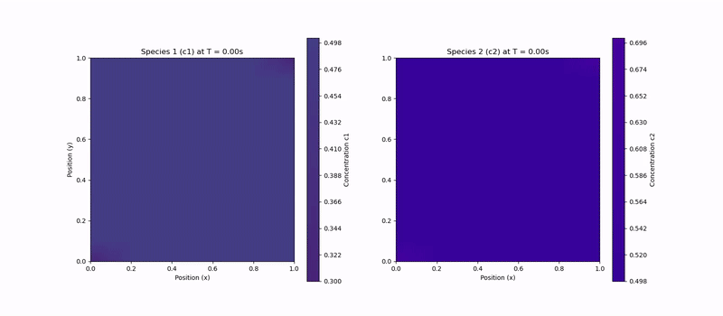

# Diffusion Dynamics from Gibbs Free Energy

In many real-world systems, diffusion is not solely driven by concentration gradients. Interactions between different chemical species can lead to complex behaviors like phase separation. This is modeled by incorporating an interaction term into the Gibbs free energy of the system. The driving force for diffusion remains the gradient of the chemical potential (μ), but the chemical potential itself becomes more complex.

The total Gibbs free energy of a binary mixture is composed of the energy of the pure components and the energy of mixing:

$$ G = c_1 G_1^0 + c_2 G_2^0 + \Delta G_{mix} $$

The mixing term is split into an ideal (entropic) part and an excess (interaction) part:

$$ \Delta G_{mix} = \Delta G_{ideal} + \Delta G_{excess} $$

For an ideal solution, only the entropic term exists, leading to Fickian diffusion. To model interactions, we use the **regular solution model**, a simplified form of the Flory-Huggins theory, which adds an excess energy term:

$$ \Delta G_{excess} = \Omega c_1 c_2 $$

Here, `Ω` is the interaction parameter. A positive `Ω` indicates a repulsive interaction between species, while a negative `Ω` indicates an attractive one.

The full Gibbs free energy per mole is then:

$$ G = c_1 G_1^0 + c_2 G_2^0 + RT(c_1 \ln(c_1) + c_2 \ln(c_2)) + \Omega c_1 c_2 $$

The chemical potential for each species is derived by taking the partial derivative of the total Gibbs energy. This results in coupled equations where the chemical potential of one species depends on the concentration of the other:

$$ \mu_1 = \mu_1^0 + RT \ln(c_1) + \Omega(1-c_1)^2 = \mu_1^0 + RT \ln(c_1) + \Omega c_2^2 $$
$$ \mu_2 = \mu_2^0 + RT \ln(c_2) + \Omega(1-c_2)^2 = \mu_2^0 + RT \ln(c_2) + \Omega c_1^2 $$

When these expressions are used in the flux equation ($ J = -M c \nabla \mu $), the model can capture phenomena that Fick's laws cannot, such as uphill diffusion and phase separation.

## Spontaneous Phase Separation (Spinodal Decomposition)

When the repulsive interaction term is strong enough (i.e., a large positive `Ω`), it can overpower the entropic tendency to mix. This causes the system to spontaneously separate into distinct phases to minimize its overall free energy. This process is known as spinodal decomposition.

The following animation demonstrates this effect. For a high interaction parameter (`Ω=6000`), an initially homogeneous mixture rapidly separates into regions rich in one species or the other.

## Finite Element Formulation

The governing dynamics are described by the Cahn-Hilliard equation (omiting the fourth order smoothing term):

$$ \frac{\partial c}{\partial t} = \nabla \cdot (M c \nabla \mu) $$

To properly formulate this for the Finite Element Method (FEM), we can split the chemical potential `μ` into its ideal (entropic) and excess (interaction) parts: `μ = μ_ideal + μ_excess`.

$$ \mu_{ideal} = RT(\ln(c) - \ln(1-c)) \quad \implies \quad M c \nabla \mu_{ideal} \approx D \nabla c $$
$$ \mu_{excess} = \Omega(1-2c) $$

The PDE can then be written as:

$$ \frac{\partial c}{\partial t} = \nabla \cdot (D \nabla c) + \nabla \cdot (M c \nabla \mu_{excess}) $$

This separates the linear Fickian diffusion from the non-linear part driven by chemical interactions. We derive the weak form by multiplying by a test function `v`, integrating over the domain `Ω`, and applying integration by parts:

$$ \int_{\Omega} \frac{\partial c}{\partial t} v \, d\Omega = - \int_{\Omega} D (\nabla c \cdot \nabla v) \, d\Omega - \int_{\Omega} M c (\nabla \mu_{excess} \cdot \nabla v) \, d\Omega $$

Next, we discretize in space using basis functions `φ_j` ($ c \approx \sum c_j \phi_j $) and the Galerkin method (`v = φ_i`). This yields a system of ordinary differential equations (ODEs):

$$ M \frac{d\mathbf{c}}{dt} + K \mathbf{c} + \mathbf{F}(\mathbf{c}) = 0 $$

Where:
- **c** is the vector of nodal concentration values `c_j`.
- **M** is the mass matrix: $ M_{ij} = \int_{\Omega} \phi_i \phi_j \, d\Omega $.
- **K** is the stiffness matrix from the ideal diffusion part: $ K_{ij} = \int_{\Omega} D (\nabla \phi_i \cdot \nabla \phi_j) \, d\Omega $.
- **F(c)** is the non-linear force vector from the interaction potential: $ F_i(\mathbf{c}) = \int_{\Omega} M c_h (\nabla \mu_{excess}(\mathbf{c}) \cdot \nabla \phi_i) \, d\Omega $.

Finally, we discretize in time using the implicit Euler method:

$$ M \frac{\mathbf{c}^{n+1} - \mathbf{c}^n}{\Delta t} + K \mathbf{c}^{n+1} + \mathbf{F}(\mathbf{c}^{n+1}) = 0 $$

This gives a non-linear system of equations to be solved at each time step, typically with a Newton-Raphson method.