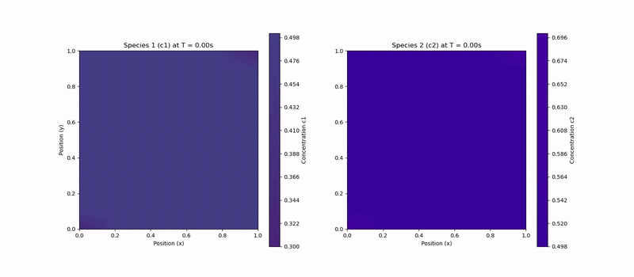

# Diffusion Dynamics from Gibbs Free Energy

In many real-world systems, diffusion is not solely driven by concentration gradients. Interactions between different chemical species can lead to complex behaviors like phase separation. This is modeled by incorporating an interaction term into the Gibbs free energy of the system. The driving force for diffusion remains the gradient of the chemical potential (μ), but the chemical potential itself becomes more complex.

The total Gibbs free energy of a binary mixture is composed of the energy of the pure components and the energy of mixing:

$$ G = c_1 G_1^0 + c_2 G_2^0 + \Delta G_{mix} $$

The mixing term is split into an ideal (entropic) part and an excess (interaction) part:

$$ \Delta G_{mix} = \Delta G_{ideal} + \Delta G_{excess} $$

For an ideal solution, only the entropic term exists, leading to Fickian diffusion. To model interactions, we use the **regular solution model**, which adds an excess energy term:

$$ \Delta G_{excess} = \Omega c_1 c_2 $$

Here, `Ω` is the interaction parameter. A positive `Ω` indicates a repulsive interaction between species, while a negative `Ω` indicates an attractive one.

The full Gibbs free energy per mole is then:

$$ G = c_1 G_1^0 + c_2 G_2^0 + RT(c_1 \ln(c_1) + c_2 \ln(c_2)) + \Omega c_1 c_2 $$

The chemical potential for each species is derived by taking the partial derivative of the total Gibbs energy. This results in coupled equations where the chemical potential of one species depends on the concentration of the other:

$$ \mu_1 = \mu_1^0 + RT \ln(c_1) + \Omega(1-c_1)^2 $$
$$ \mu_2 = \mu_2^0 + RT \ln(c_2) + \Omega(1-c_2)^2 $$

When these expressions are used in the flux equation ($ J = -M c \nabla \mu $), the model can capture phenomena that Fick's laws cannot, such as uphill diffusion and phase separation.

## Spontaneous Phase Separation (Spinodal Decomposition)

When the repulsive interaction term is strong enough (i.e., a large positive `Ω`), it can overpower the entropic tendency to mix. This causes the system to spontaneously separate into distinct phases to minimize its overall free energy. This process is known as spinodal decomposition.

The following animation demonstrates this effect. For a high interaction parameter (`Ω=6000`), an initially homogeneous mixture rapidly separates into regions rich in one species or the other.

