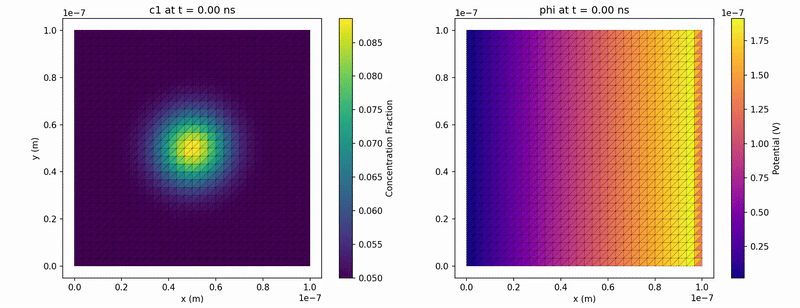

# Nernst-Planck-Poisson Equations from Free Energy Functional

This document presents the complete derivation of the coupled Nernst-Planck-Poisson (NPP) system from a fundamental free energy functional, following a systematic approach from abstract physics to concrete computational implementation.

## Modeling Framework Overview

We use the fundamental physical principle minimizing free energy for modeling ion transport in a medium.
We have 1 electric field affecting and being affected by 2 ion concentration (density) fields. These ions interact with themselves and optionally also with each other.

To discretize space we use finite element simulation. To discretize time we use the implicit Euler method.

## 1. The Free Energy Functional of the whole system

We begin with the **Free Energy Functional** $G$, which represents the total energy of the system modelling 3 types of interactions: entropy (1-1 and 2-2), chemical interactions (1-2), and electrostatics (1-phi, 2-phi and phi-phi).

$$G[c_1, c_2, \phi] = \int_{\Omega} \left( RT(c_1 \ln c_1 + c_2 \ln c_2) + \chi c_1 c_2 + \frac{1}{2} \epsilon |\nabla \phi|^2 + F(z_1 c_1 + z_2 c_2) \phi \right) dV$$

**Where:**
- $c_1, c_2$ are the concentrations of ionic species 1 and 2
- $\phi$ is the electric potential
- $RT$ is the thermal energy scale
- $\chi$ is the interaction parameter between species
- $\epsilon$ is the dielectric permittivity
- $F$ is Faraday's constant
- $z_1, z_2$ are the valences of the ionic species

**Physical Interpretation:**
- **First term**: Ideal mixing entropy (drives diffusion)
- **Second term**: Chemical interactions between species
- **Third term**: Electrostatic field energy
- **Fourth term**: Coupling between charge density and electric potential

## 2. Deriving the Continuous PDEs via Functional Derivatives

The governing equations emerge from the principle of energy minimization. We derive the continuous PDEs by taking functional derivatives of $G$ with respect to each field.

### 2.1 Species Conservation: Nernst-Planck Equations

The flux $J_i$ for each species is driven by the gradient of the electrochemical potential:

$$\tilde{\mu}_i = \frac{\delta G}{\delta c_i}$$

For species 1:
$$\tilde{\mu}_1 = RT \ln c_1 + RT + \chi c_2 + z_1 F \phi$$

For species 2:
$$\tilde{\mu}_2 = RT \ln c_2 + RT + \chi c_1 + z_2 F \phi$$

The flux follows the generalized diffusion law:
$$J_i = -D_i c_i \nabla \left(\frac{\tilde{\mu}_i}{RT}\right)$$

Expanding this gives the **Nernst-Planck equations**:

$$\frac{\partial c_1}{\partial t} = -\nabla \cdot J_1 = \nabla \cdot \left(D_1 \nabla c_1 + \frac{D_1 \chi c_1}{RT} \nabla c_2 + \frac{D_1 z_1 F c_1}{RT} \nabla \phi\right)$$

$$\frac{\partial c_2}{\partial t} = -\nabla \cdot J_2 = \nabla \cdot \left(D_2 \nabla c_2 + \frac{D_2 \chi c_2}{RT} \nabla c_1 + \frac{D_2 z_2 F c_2}{RT} \nabla \phi\right)$$

### 2.2 Electrostatics: Poisson's Equation

The system minimizes energy with respect to the potential, so $\frac{\delta G}{\delta \phi} = 0$:

$$\frac{\delta G}{\delta \phi} = -\epsilon \nabla^2 \phi + F(z_1 c_1 + z_2 c_2) = 0$$

This yields **Poisson's Equation**:
$$-\epsilon \nabla^2 \phi - F(z_1 c_1 + z_2 c_2) = 0$$

## 3. Time Discretization: Backward Euler Method

We discretize the time derivatives using the implicit backward Euler scheme for stability. We replace $\frac{\partial c}{\partial t}$ with $\frac{c^{n+1} - c^n}{\Delta t}$, where all spatial terms are evaluated at the unknown future time $n+1$.

This transforms the transient PDEs into a set of non-linear, steady-state-like equations to be solved at each time step:

$$\frac{c_1^{n+1} - c_1^n}{\Delta t} = \nabla \cdot \left(D_1 \nabla c_1^{n+1} + \frac{D_1 z_1 F c_1^{n+1}}{RT} \nabla \phi^{n+1} + \text{interaction terms}\right)$$

$$\frac{c_2^{n+1} - c_2^n}{\Delta t} = \nabla \cdot \left(D_2 \nabla c_2^{n+1} + \frac{D_2 z_2 F c_2^{n+1}}{RT} \nabla \phi^{n+1} + \text{interaction terms}\right)$$

$$-\epsilon \nabla^2 \phi^{n+1} - F(z_1 c_1^{n+1} + z_2 c_2^{n+1}) = 0$$

## 4. Spatial Discretization: Finite Element Method

We apply the Finite Element Method to the time-discretized equations by:
1. Writing the **weak form** of each equation (multiplying by test functions and integrating)
2. Approximating the fields using shape functions and nodal values
3. Transforming the integral equations into algebraic equations

### 4.1 Discretization of the $c_1$ Equation

Let's focus on how to discretize the $c_1$ equation into matrix form. We start with the weak form using test functions $N_i$:

**Weak form for $c_1$:**
$$\int_{\Omega} N_i \frac{c_1^{n+1} - c_1^n}{\Delta t} d\Omega + \int_{\Omega} \nabla N_i \cdot \left(D_1 \nabla c_1^{n+1} + \frac{D_1 z_1 F c_1^{n+1}}{RT} \nabla \phi^{n+1}\right) d\Omega = 0$$

**Step 1: Approximate the fields using shape functions**

We approximate each field using nodal values and shape functions $N_j$:
$$c_1^{n+1}(\mathbf{x}) = \sum_{j=1}^{N} \hat{c}_{1,j}^{n+1} N_j(\mathbf{x})$$
$$\phi^{n+1}(\mathbf{x}) = \sum_{j=1}^{N} \hat{\phi}_j^{n+1} N_j(\mathbf{x})$$

**Step 2: Substitute approximations into the weak form**

Substituting these approximations:
$$\int_{\Omega} N_i \frac{\sum_j \hat{c}_{1,j}^{n+1} N_j - \sum_j \hat{c}_{1,j}^n N_j}{\Delta t} d\Omega + \int_{\Omega} \nabla N_i \cdot \left(D_1 \nabla \sum_j \hat{c}_{1,j}^{n+1} N_j + \frac{D_1 z_1 F}{RT} \sum_j \hat{c}_{1,j}^{n+1} N_j \nabla \sum_k \hat{\phi}_k^{n+1} N_k\right) d\Omega = 0$$

**Step 3: Separate into matrix components**

Rearranging and factoring out the nodal values:
$$\sum_j \left[\frac{1}{\Delta t} \int_{\Omega} N_i N_j d\Omega + D_1 \int_{\Omega} \nabla N_i \cdot \nabla N_j d\Omega\right] \hat{c}_{1,j}^{n+1} + \sum_k \left[\frac{D_1 z_1 F}{RT} \int_{\Omega} \nabla N_i \cdot \nabla N_k \sum_j \hat{c}_{1,j}^{n+1} N_j d\Omega\right] \hat{\phi}_k^{n+1} = \sum_j \frac{1}{\Delta t} \int_{\Omega} N_i N_j d\Omega \hat{c}_{1,j}^n$$

**Step 4: Define the matrix components**

- **Mass matrix**: $M_{ij} = \int_{\Omega} N_i N_j d\Omega$
- **Diffusion stiffness matrix**: $K_{ij}^{diff} = D_1 \int_{\Omega} \nabla N_i \cdot \nabla N_j d\Omega$
- **Electromigration coupling matrix**: $K_{ik}^{elec} = \frac{D_1 z_1 F}{RT} \int_{\Omega} \nabla N_i \cdot \nabla N_k \sum_j \hat{c}_{1,j}^{n+1} N_j d\Omega$

**Step 5: Matrix equation for $c_1$**

This gives us the matrix equation:
$$\left[\frac{\mathbf{M}}{\Delta t} + \mathbf{K}^{diff}\right] \{\hat{\mathbf{c}}_1^{n+1}\} + \mathbf{K}^{elec} \{\hat{\boldsymbol{\phi}}^{n+1}\} = \frac{\mathbf{M}}{\Delta t} \{\hat{\mathbf{c}}_1^n\}$$

The same process applies to the $c_2$ and $\phi$ equations, generating the complete block system.

### 4.2 Matrix Notation

Each equation generates a block row in the system matrix:

**First block row (from $c_1$ equation):**
$$\left[\frac{\mathbf{M}_{c_1c_1}}{\Delta t} + \mathbf{K}_{c_1c_1}\right]\{\hat{c}_1^{n+1}\} + [\mathbf{K}_{c_1\phi}]\{\hat{\phi}^{n+1}\} = \frac{\mathbf{M}_{c_1c_1}}{\Delta t} \{\hat{c}_1^{n}\}$$

**Second block row (from $c_2$ equation):**
$$\left[\frac{\mathbf{M}_{c_2c_2}}{\Delta t} + \mathbf{K}_{c_2c_2}\right]\{\hat{c}_2^{n+1}\} + [\mathbf{K}_{c_2\phi}]\{\hat{\phi}^{n+1}\} = \frac{\mathbf{M}_{c_2c_2}}{\Delta t} \{\hat{c}_2^{n}\}$$

**Third block row (from $\phi$ equation):**
$$[\mathbf{K}_{\phi\phi}]\{\hat{\phi}^{n+1}\} + [\mathbf{K}_{\phi c_1}]\{\hat{c}_1^{n+1}\} + [\mathbf{K}_{\phi c_2}]\{\hat{c}_2^{n+1}\} = \{0\}$$

## 5. The Complete Monolithic System

The final system to be solved at each time step is the fully coupled block matrix system:

$$
\begin{bmatrix}
    \frac{\mathbf{M}_{c_1c_1}}{\Delta t} + \mathbf{K}_{c_1c_1} & \mathbf{0} & \mathbf{K}_{c_1\phi} \\
    \mathbf{0} & \frac{\mathbf{M}_{c_2c_2}}{\Delta t} + \mathbf{K}_{c_2c_2} & \mathbf{K}_{c_2\phi} \\
    \mathbf{K}_{\phi c_1} & \mathbf{K}_{\phi c_2} & \mathbf{K}_{\phi\phi}
\end{bmatrix}
\begin{bmatrix}
    \mathbf{\hat{c}}_1^{n+1} \\
    \mathbf{\hat{c}}_2^{n+1} \\
    \mathbf{\hat{\phi}}^{n+1}
\end{bmatrix}
=
\begin{bmatrix}
    \frac{\mathbf{M}_{c_1c_1}}{\Delta t} \mathbf{\hat{c}}_1^{n} \\
    \frac{\mathbf{M}_{c_2c_2}}{\Delta t} \mathbf{\hat{c}}_2^{n} \\
    \mathbf{0}
\end{bmatrix}
$$

### Matrix Definitions

**Mass Matrices** (from temporal terms):
- $M_{ij} = \int_{\Omega} N_i N_j \, d\Omega$

**Stiffness Matrices** (from spatial terms):
- $K_{c_ic_i,ij} = \int_{\Omega} D_i (\nabla N_i \cdot \nabla N_j) \, d\Omega$ (diffusion)
- $K_{c_i\phi,ij} = \int_{\Omega} \frac{D_i z_i F}{RT} N_j (\nabla N_i \cdot \nabla \phi^{n+1}) \, d\Omega$ (electromigration)
- $K_{\phi\phi,ij} = \int_{\Omega} \epsilon (\nabla N_i \cdot \nabla N_j) \, d\Omega$ (electrostatics)
- $K_{\phi c_i,ij} = -\int_{\Omega} F z_i N_i N_j \, d\Omega$ (charge coupling)

## Computational Implementation

The resulting system is solved using:
- **Newton-Raphson iteration** for the non-linear system at each time step
- **Proper boundary conditions** for realistic electrochemical scenarios

## Example

